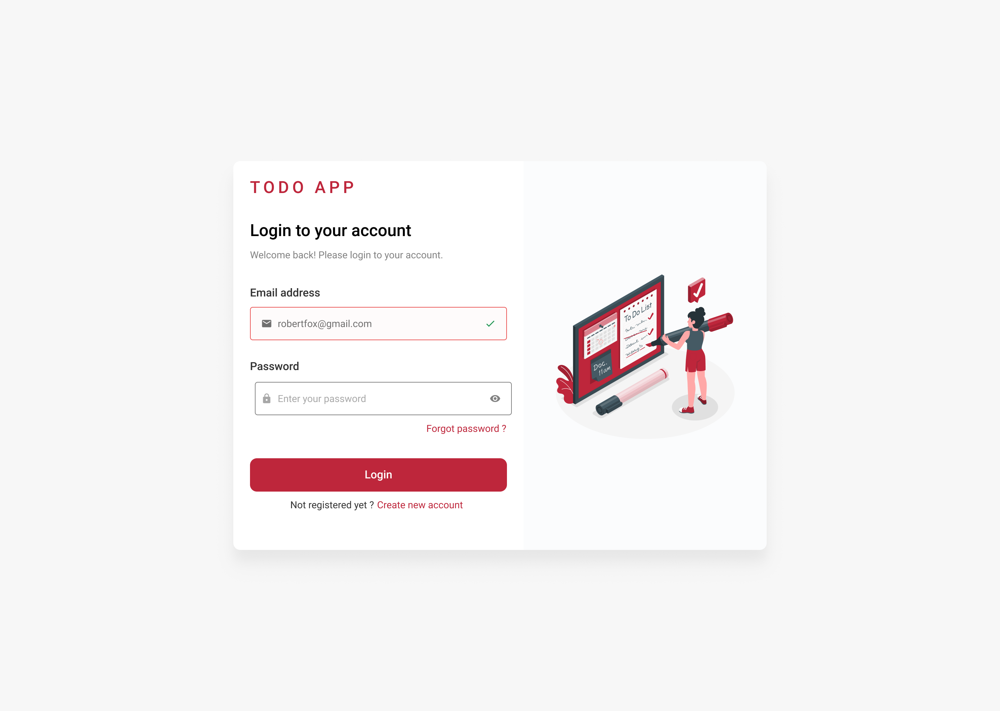

# ToDo-Web
A ToDO Web App made with odoo framework using client action.

## Web App Design
**Login page**  

**Signup page**  

**Dashboard**  

**New Task Category Form**  

**New Task Form**  

**Forgot Password**  

**Email Send Card**  

More figma desgins for the web app at [HERE](./figma/)
